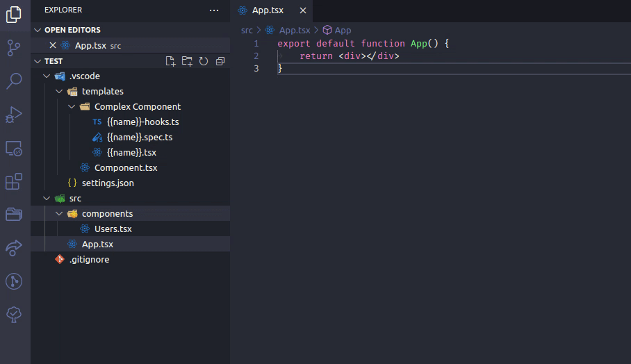
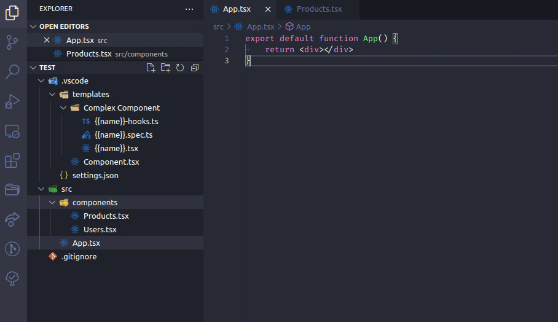

# rhangai.file-template vscode extension

Generate templates from a single file or multiple files

## Creating files

Right click in your explore panel and select `Create from template`

## Creating templates

Create a `.vscode/templates` folder in your project root

### File templates

Just create a new file inside the templates dir. Every file will be considered a new template.

### Folder templates

Folder templates allow the creationg of multiple files. Every file inside the template folder
will be created in the destination.

## Template substitution

Every template is compiled through `mustache`. So you can use `{{ var }}` substitution

The following variables are allowed in template substitution

- name: User input when creating templates
- nameParam: The name variable, except param cased (`some-name`)
- nameCamel: The name variable, except camel cased (`someName`)
- namePascal: The name variable, except camel cased (`SomeName`)
- dir: Base dir destination name

## Examples

### Single file template

The gif belows create a single file from the Component template

### Folder templates

The gif belows create 3 files: clients-hooks.ts, clients.spec.ts, clients.tsx

